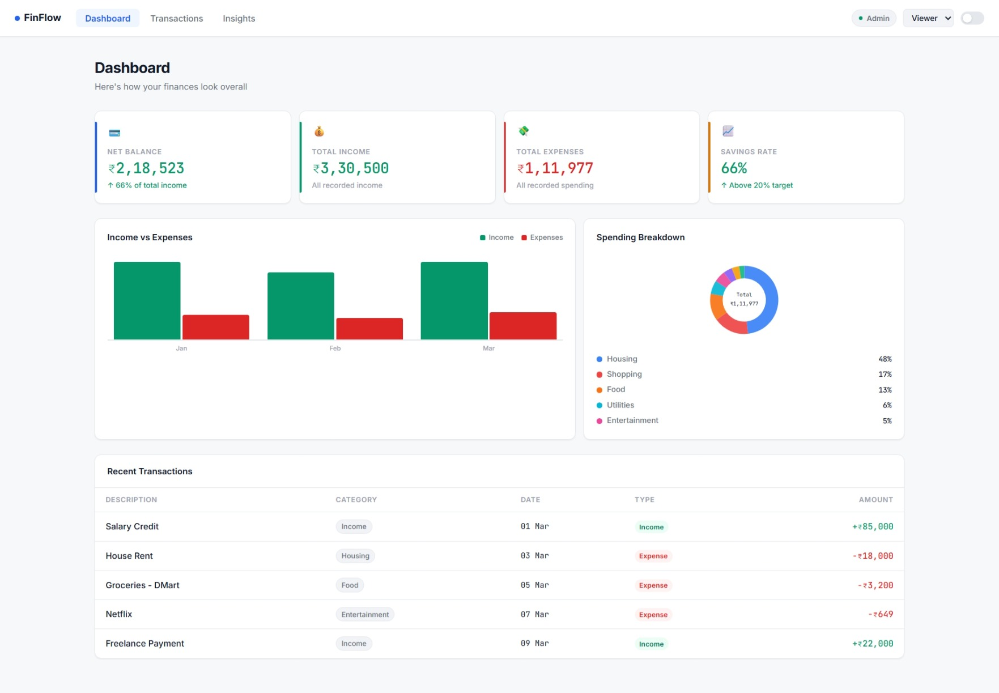
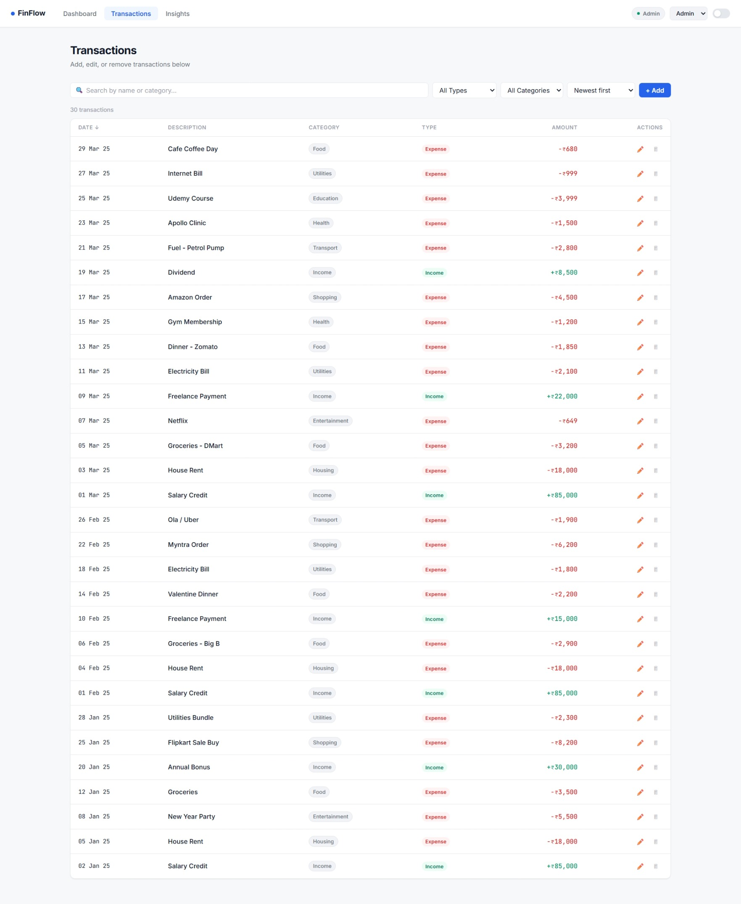
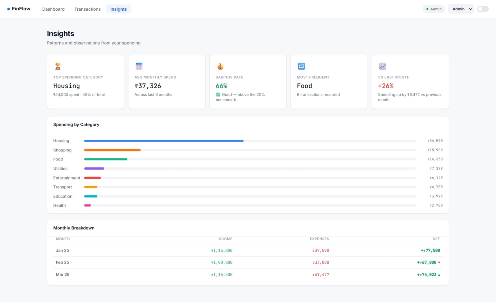

# FinFlow - A React Finance Dashboard 💹

FinFlow is a frontend web application developed to help users track their income, expenses, and understand their monthly spending habits. It is designed to be a clean and practical personal finance tracker, with the ability to manage transactions, view spending charts, switch between roles, and gain useful insights — all without any backend.

## Key Features

- **Role-Based UI (Admin & Viewer):** Users can switch between Admin and Viewer roles using a dropdown in the navbar. Admin users have full access to add, edit, and delete transactions. Viewer users can only view data — all edit controls are hidden and a banner appears to make the restriction clear.
- **Toast Notifications:** Small feedback messages appear after every action — adding, editing, or deleting a transaction — to confirm what just happened.
- **CRUD Operations:** Admin users can **Create**, **Read**, **Update**, and **Delete** transactions, allowing complete control over their financial records.
- **Charts & Visualizations:** A monthly bar chart shows Income vs Expenses over time. A donut chart breaks down spending by category. Both are built with pure SVG — no charting library used.
- **Insights Page:** Highlights the highest spending category, average monthly spend, savings rate with colour-coded feedback, and a month-over-month percentage comparison.
- **Dark Mode:** Toggle between light and dark theme directly from the navbar.
- **Responsive Design:** The layout adapts cleanly across mobile, tablet, and desktop screen sizes.

## Technologies Used

- **Frontend:**
  - React 18
  - JavaScript (ES6+)
  - Custom CSS (no UI library)

- **State Management:**
  - useReducer + Context API — for managing transactions, filters, and role globally across all components

- **Charts:**
  - Pure SVG — bar chart and donut chart built from scratch without Recharts or Chart.js

- **Fonts:**
  - Inter (UI text)
  - JetBrains Mono (all numbers and monetary amounts)

## Deployment

Currently running locally. Deployment to Vercel is in progress.

📁 GitHub Repository: [🔗 FinFlow - GitHub](https://github.com/Kusuma444/finflow-dashboard)

## Setup Instructions

### 1. Clone the Repository

Clone the repository to your local machine using the following command:

```bash
git clone https://github.com/Kusuma444/finflow-dashboard.git
```

### 2. Install Dependencies

Navigate to the project folder and install the necessary dependencies using npm:

```bash
cd finflow-dashboard
npm install
```

### 3. Run the Application

To start the development server, run the following command:

```bash
npm start
```

The application will be available at http://localhost:3000

> No environment variables or backend setup required. The app runs entirely on the frontend with mock data already seeded on load.

## Project Structure
finflow-dashboard/
│
├── public/                    # Static files
├── src/
│   ├── components/
│   │   ├── Dashboard.js       # Overview page with summary cards and charts
│   │   ├── Transactions.js    # Full transaction list with filters and CRUD
│   │   ├── Insights.js        # Spending analysis and monthly breakdown
│   │   └── Navbar.js          # Navigation, role switcher, dark mode toggle
│   ├── App.js                 # Root component, Context provider, reducer and state setup
│   ├── App.css                # Full design system and all component styles
│   └── index.js               # Entry point
├── package.json
└── README.md                  # This file
## How It Works

**Role-Based UI:**

Users can switch between Admin and Viewer roles using the dropdown in the navbar. Admin users get full access to add, edit, and delete transactions. Viewer users can only view — all edit controls are hidden, and a banner appears at the top to make the restriction obvious.

**Transaction Management:**

Users can search transactions by name or category, filter by type (income or expense) and category, and sort by date or amount. Admin users can open a modal form to add a new transaction or edit an existing one. Deleting a transaction asks for confirmation before removing it permanently.

**Charts:**

Both charts are built with raw SVG path calculations — no external library. The bar chart scales bar heights as a percentage of the highest monthly value. The donut chart uses arc path math to draw each spending category as a proportional slice with a center label.

**State Management:**

All application state — transactions, filters, and the current role — is managed using useReducer and React Context. The reducer handles four actions: ADD_TRANSACTION, EDIT_TRANSACTION, DELETE_TRANSACTION, and SET_FILTER. This keeps all logic centralized and easy to follow without any third-party library.

**Insights Page:**

The Insights page reads directly from the transaction data to calculate the top spending category, average monthly spend, savings rate, most frequently occurring expense category, and whether spending went up or down compared to the previous month.

## Contributing

Contributions are welcome! If you find a bug or want to suggest a new feature, feel free to open an issue or submit a pull request.

1. Fork the repository.
2. Create a new branch.
3. Make your changes.
4. Submit a pull request with a description of your changes.
   ## Screenshots

**Dashboard Overview**



**Transactions Page**



**Insights Page**



---

## Author

**Kusuma**
GitHub: [@Kusuma444](https://github.com/Kusuma444)
